### 1. Описание функциональности монолитного приложения

**Управление отоплением:**

- Пользователи могут управлять отоплением в доме через запрос к серверу (включить/выключить, установить целевую температуру);
- Каждая установка системы отопления сопровождается обязательным выездом специалиста для подключения к текущей версии системы.

**Мониторинг температуры:**

- Пользователи могут проверять текущую температуру в доме через запрос к серверу;
- Данные о температуре получаются синхронно: сервер отправляет запрос датчику и ждёт ответа.

### 2. Анализ архитектуры монолитного приложения

- Технологии: монолит на Go, СУБД PostgreSQL;
- Стиль взаимодействия: полностью синхронное (HTTP/RPC). Отсутствуют асинхронные вызовы, микросервисы, реактивные паттерны;
- Управление: инициатива всегда от сервера к датчику (опрос). Датчики не могут сами отправлять данные;
- Подключение устройств: пользователь не может самостоятельно подключить датчик – требуется специалист.

### 3. Определение доменов и границы контекстов

На основе бизнес-целей и требований к целевой экосистеме выделены следующие **домены** (бизнес-области) и **ограниченные контексты** (bounded contexts):

| Домен | Ограниченный контекст | Описание |
|-------|----------------------|-----------|
| Отопление | Heating Service | Управление температурой, режимами отопления, чтение показаний датчиков температуры. |
| Освещение | Lighting Service | Включение/выключение света, регулировка яркости, сценарии освещения. |
| Ворота | Gate Service | Открытие/закрытие автоматических ворот, контроль доступа. |
| Видеонаблюдение | Surveillance Service | Потоковое видео, детекция движения, запись событий. |
| Устройства | Device Registry Service | Регистрация новых устройств (самостоятельно пользователем), конфигурация, поддержка стандартных протоколов (Zigbee, MQTT, HTTP API). |
| Телеметрия | Telemetry Service | Сбор, хранение и визуализация данных с датчиков (температура, влажность, энергопотребление и др.). |
| Автоматизация | Automation Service | Программирование правил, выполнение сценариев. |
| Пользователи | User Service | Регистрация, аутентификация, управление ролями. |
| Биллинг | Billing Service | Управление подписками, оплата. |

**Границы контекстов** соответствуют бизнес-возможностям и позволяют развивать каждый сервис независимо. Взаимодействие между контекстами будет происходить через синхронные API (REST/gRPC) и асинхронные сообщения через брокер.

### 4. Проблемы монолитного решения

- Самостоятельно подключить свой датчик к системе пользователь не может.
- Малое количество доступных для подключения типов устройств (только отопление).
- Сложность подключения — требуется выезд специалиста.
- Высокая нагрузка на центральный сервер из-за синхронных опросов датчиков.
- Низкая масштабируемость — монолит сложно масштабировать под разные виды нагрузки.
- Отсутствие асинхронного взаимодействия — долгие операции блокируют сервер.

### 5. Визуализация контекста системы — диаграмма С4

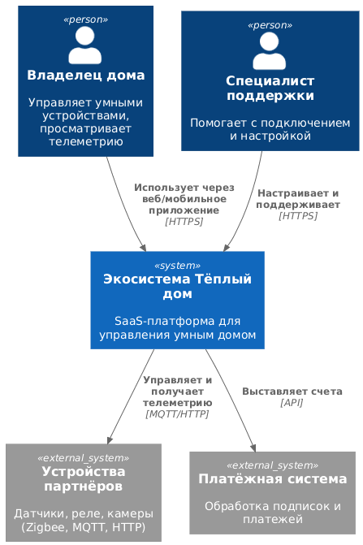

**Диаграмма контейнеров (Containers)**

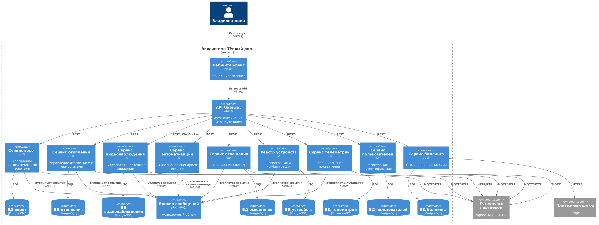

**Диаграмма компонентов (Components)**

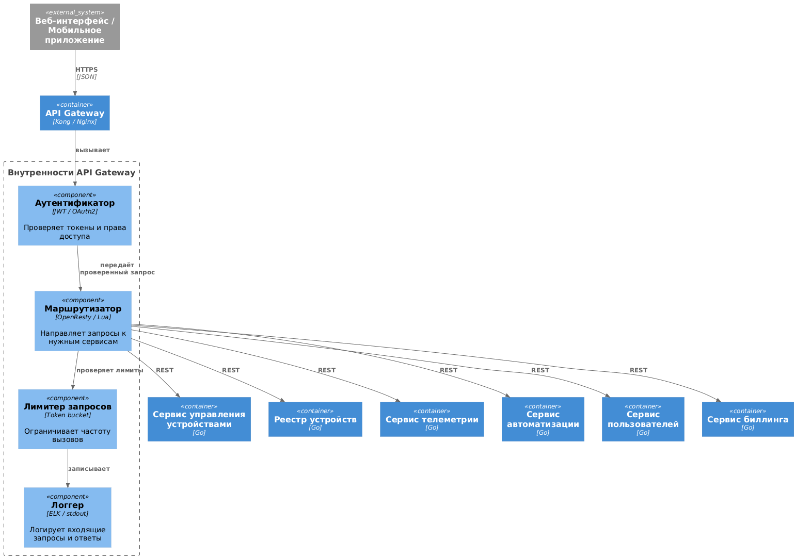
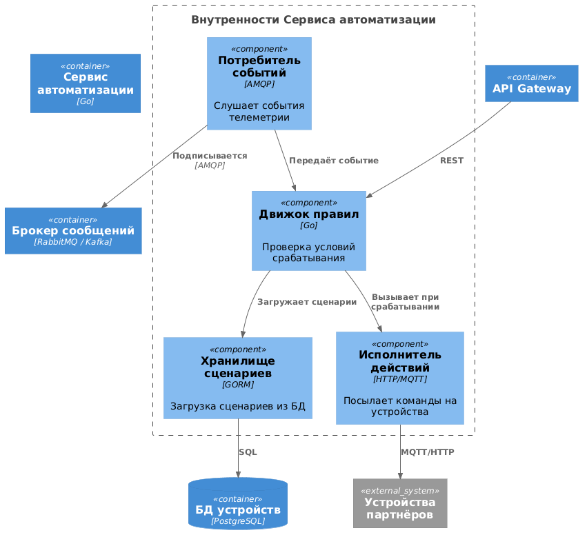
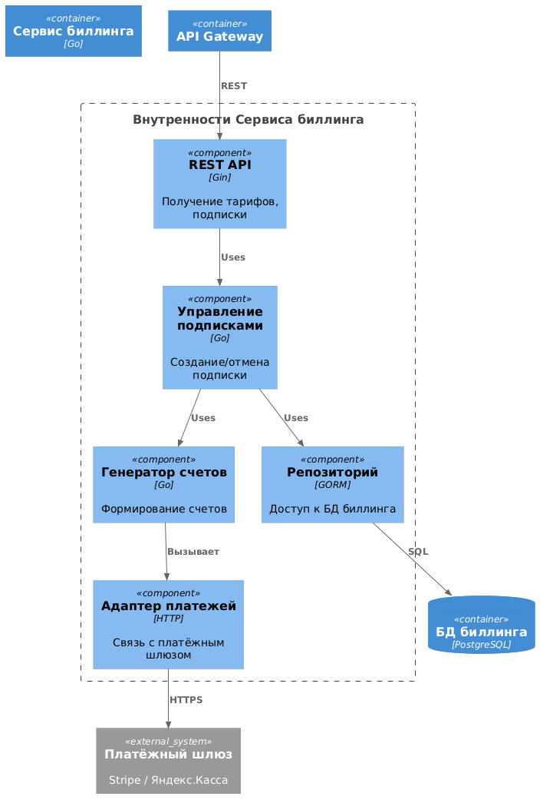
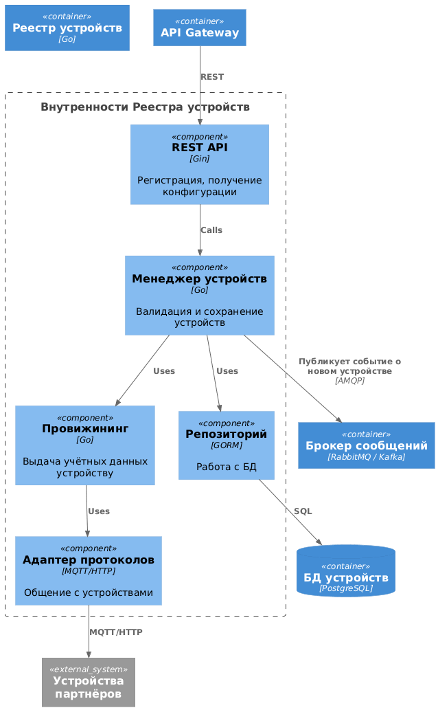
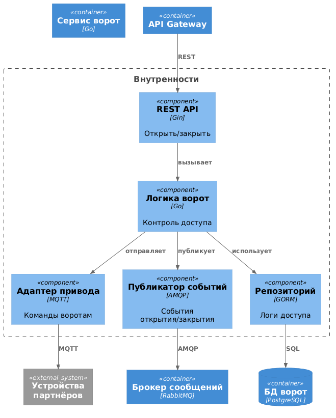
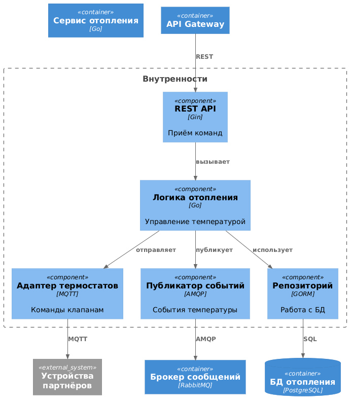
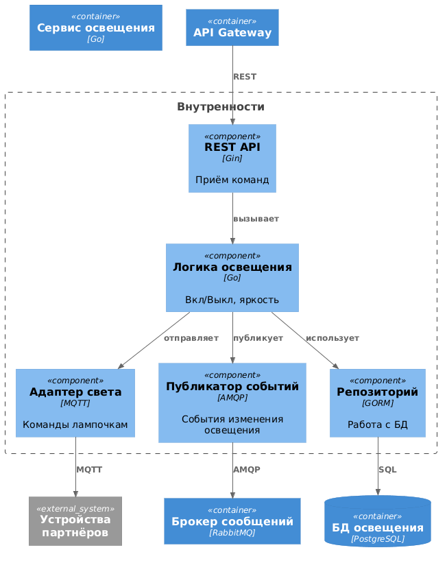
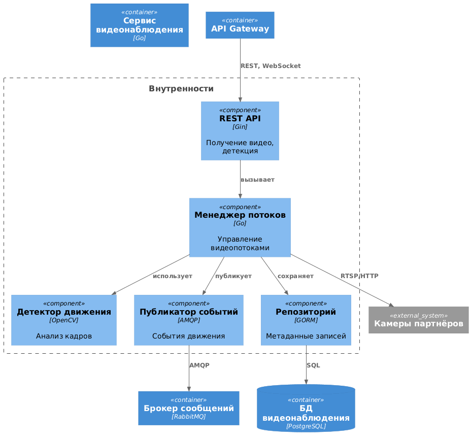
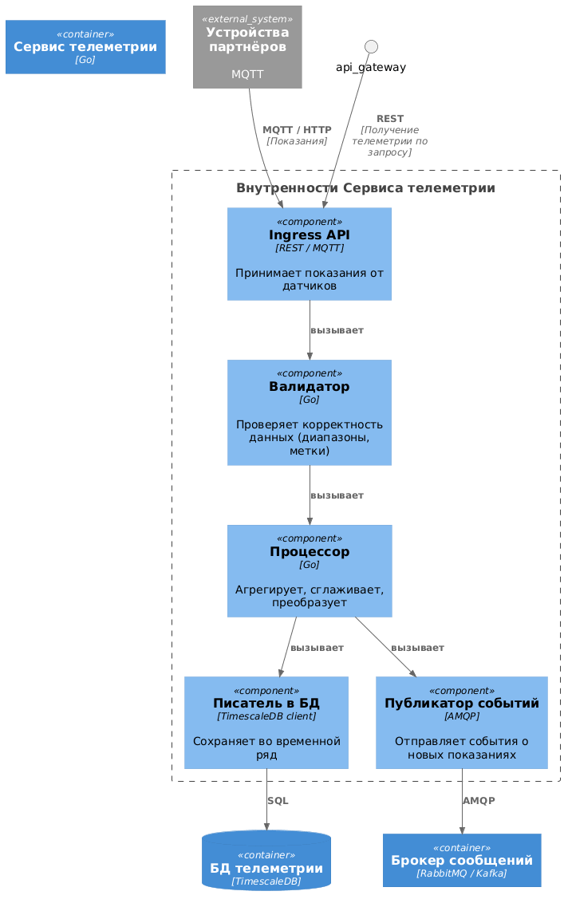
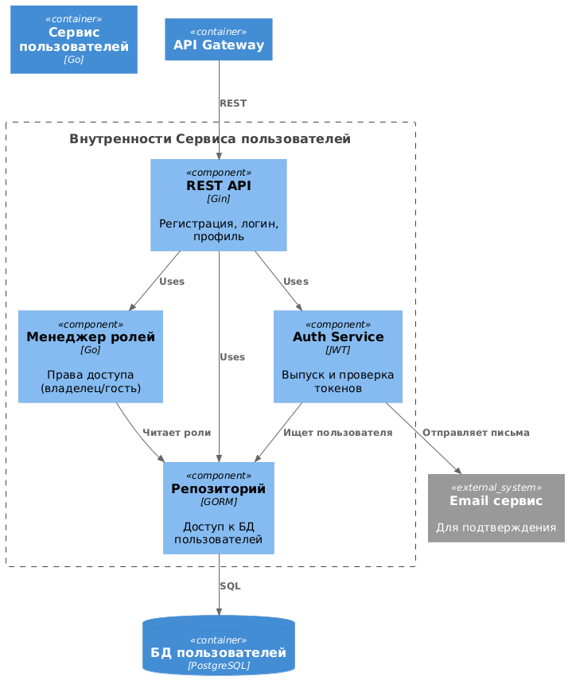

**Диаграмма кода (Code)**

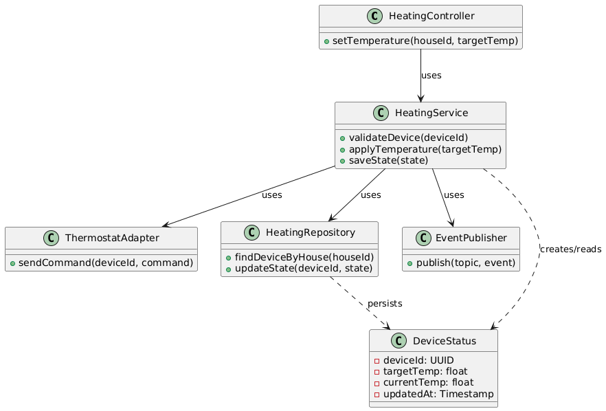

# Задание 3. Разработка ER-диаграммы

**ER-диаграмма**

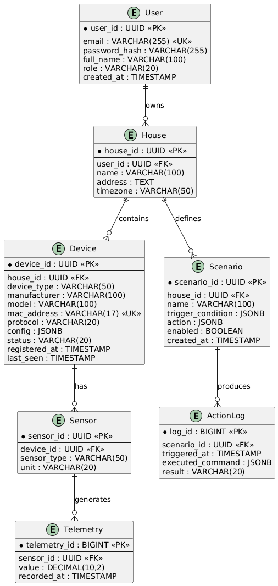

# Задание 4. Создание и документирование API

### 1. Тип API

Для взаимодействия между микросервисами и для внешних вызовов используется **синхронный REST API** (протокол HTTP/1.1, формат JSON). Данное решение принято из-за простоты реализации, наглядности и повсеместной поддержки (OpenAPI/Swagger для документации).
Для асинхронных процессов (например, приёма телеметрии от датчиков или выполнения длительных сценариев) используется **брокер сообщений** с протоколом AMQP.

### 2. Документация API

API для управления датчиками описано в стандарте **OpenAPI 3.0**. Спецификация доступна по следующей ссылке:

- [openapi.yaml](openapi.yaml)

Для просмотра в удобном формате можно импортировать этот файл в [Swagger Editor](https://editor.swagger.io/) или в **Postman** (импортировать как OpenAPI).
